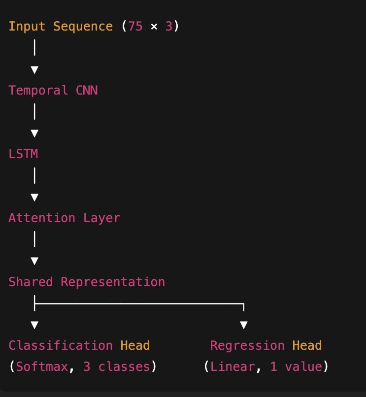

# EV Braking Intention Prediction Using Deep Learning 

## Project Overview
This project focuses on predicting **driver braking intention** (Light, Normal, Emergency) from vehicle time-series data under **ambiguous and overlapping driving scenarios**. Such prediction is critical for advanced driver-assistance systems (ADAS) and electric vehicle control, where early and reliable intent estimation improves safety and energy efficiency.

The project systematically evaluates and compares multiple deep learning strategies, highlighting why **multitask learning** is more effective than feature compression–based approaches for this problem.

---

## 🎥 Demo

Below is a short demo of the interactive Streamlit application showcasing:

- Scenario presets (one-click simulations)
- Time-series signal visualization (speed, acceleration, brake pedal)
- Multitask prediction outputs (braking class + intensity)
- Exportable prediction reports


---

## Approach Summary

The project was developed in four structured phases:

1. **Baseline Model**  
   Implemented a single-task **LSTM–CNN–Attention** network to predict braking intention from time-series inputs (speed, acceleration, brake pedal).

2. **Autoencoder Exploration**  
   Introduced a sequence autoencoder to learn compressed latent representations before classification.  
   Result: performance degraded under ambiguous braking scenarios due to loss of fine-grained temporal cues.

3. **Multitask Learning (Final Model)**  
   Designed a **multitask LSTM–CNN–Attention** model that jointly predicts:
   - **Braking Intention** (classification)
   - **Future Braking Intensity** (regression)

   This adds task-aligned supervision instead of compressing information.

4. **Controlled Optimization**  
   Tuned the regression loss weight (λ) to strengthen auxiliary supervision and improve class-wise robustness.

All experiments were conducted on a **HARD synthetic dataset** specifically designed to simulate overlapping braking behaviors and future-dependent intent.

---

## Model Architecture



---

## Quantitative Results

| Model | Accuracy | Macro F1 | Normal Braking F1 | Emergency Braking F1 |
|------|----------|----------|-------------------|----------------------|
| Baseline (Single-task) | 69.6% | 70% | ~59% | ~78% |
| AE + Classifier (Best) | 64.1% | 64% | ~56% | ~77% |
| Multitask (λ = 0.5) | 69.0% | 70% | ~57% | ~77% |
| **Multitask (λ = 0.8)** | **71.3%** | **72%** | **59%** | **82%** |


Note: Minor variations in accuracy across retraining runs are expected due to random initialization and stochastic optimization. The multitask model consistently outperformed single-task and autoencoder-based approaches, particularly on the safety-critical emergency braking class.

---

## Key Findings

- Autoencoder-based representation learning **degraded performance** under class ambiguity by suppressing subtle temporal cues.
- Multitask learning improved robustness by **adding supervision instead of compressing features**.
- Increasing regression loss weight (λ = 0.8) produced the best balance between:
  - overall accuracy
  - Normal-braking discrimination
  - Emergency-braking recall (safety-critical class)
- Final multitask model achieved:
  - **+1.5% absolute accuracy gain**
  - **+4% macro-F1 improvement**
  - **82% F1-score for Emergency Braking**

---

## 🧠 Assumptions & Design Choices

This project is designed as a research-oriented and demo-friendly system.  
Key assumptions made during modeling and UI design are listed below:

### Data Assumptions
- Vehicle data is **synthetically generated** to simulate realistic braking behavior.
- Input signals (speed, acceleration, brake pedal) are assumed to be:
  - Noise-corrupted but bounded
  - Temporally consistent
- Absolute physical units are simplified for modeling clarity.

### Modeling Assumptions
- Braking intention can be inferred from **short time windows** of vehicle dynamics.
- Multitask learning (classification + regression) improves representation learning by:
  - Providing auxiliary supervision
  - Reducing ambiguity in overlapping braking behaviors
- Brake intensity regression is assumed to be **continuous and monotonic** with braking aggressiveness.

### UI & Demo Assumptions
- Scenario presets are **illustrative**, not exhaustive of real-world driving cases.
- The Streamlit interface prioritizes **interpretability and communication** over real-time deployment constraints.
- Predictions are **advisory**, not intended for direct vehicle control.

### Limitations
- Model is trained on synthetic data; real-world deployment would require:
  - Sensor calibration
  - Domain adaptation
  - Validation on real driving datasets
- Reaction latency, road conditions, and driver intent beyond braking are not modeled.

---
 
## Conclusion

For ambiguous, future-dependent braking intention prediction, **multitask learning outperforms both single-task learning and autoencoder-based approaches**.  

Auxiliary regression of braking intensity provides meaningful, task-aligned supervision that improves generalization **without increasing model complexity**.

---

## Technologies Used
- LSTM
- CNN
- Attention
- Autoencoder 
- PyTorch
- Python
- NumPy
- scikit-learn

---

## Installation & Setup

Clone the repository and install dependencies:

```bash
git clone https://github.com/your-username/braking-intention-prediction.git
cd braking-intention-prediction
pip install -r requirements.txt
```

(Optional) If using Jupyter notebooks:
```bash
python -m ipykernel install --user --name braking-intent
```


---

## How to Run

### 1. Generate Dataset
```bash
python data/generate_dataset.py
python data/generate_hard_dataset.py
```
This will create .npy files containing time-series samples and labels.

2. Train Baseline Model

Open and run:
```
01_train_baseline.ipynb
```
3. Train Multitask Model (Final)

Open and run:
```
02_multitask_training.ipynb
```
All results, confusion matrices, and metrics are produced inside the notebooks.


---

## References

This project reproduces and extends ideas from the following research work:

Wei Yang, Yu Huang, Kongming Jiang, Zhen Zhang, Ketong Zong, Qin Ruan,  
**“Method of Predicting Braking Intention Using LSTM-CNN-Attention With Hyperparameters Optimized by Genetic Algorithm”**,  
*International Journal of Control, Automation and Systems*, Springer, 2024. :contentReference[oaicite:0]{index=0}

The original paper proposes an LSTM–CNN–Attention architecture for braking intention prediction using simulator-based driving data.  
This project reimplements the core architecture and introduces:
- harder ambiguous synthetic datasets
- systematic ablation studies
- multitask learning with braking intensity regression

